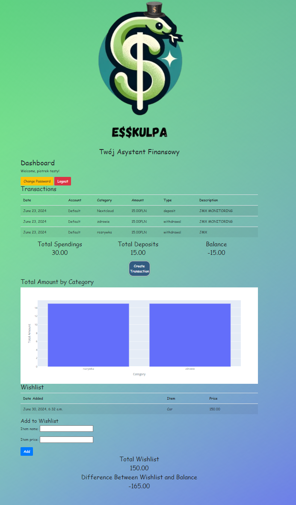

# Aplikacja do zarzadzania finansami osobistymi

## How to install?

1. Clone the repository:
   ```bash
   git clone https://github.com/Rapian99/Aplikacja-do-zarzadzania-finansami-osobistymi.git
   ```

2. Navigate to the application directory:
   ```bash
   cd Aplikacja-do-zarzadzania-finansami-osobistymi
   ```

3. Install the required libraries:
   ```bash
   pip install -r requirements.txt
   ```

4. Start the application:
   ```bash
   python3 manage.py runserver
   ```

Your application will run on port 8000.
## Example:

